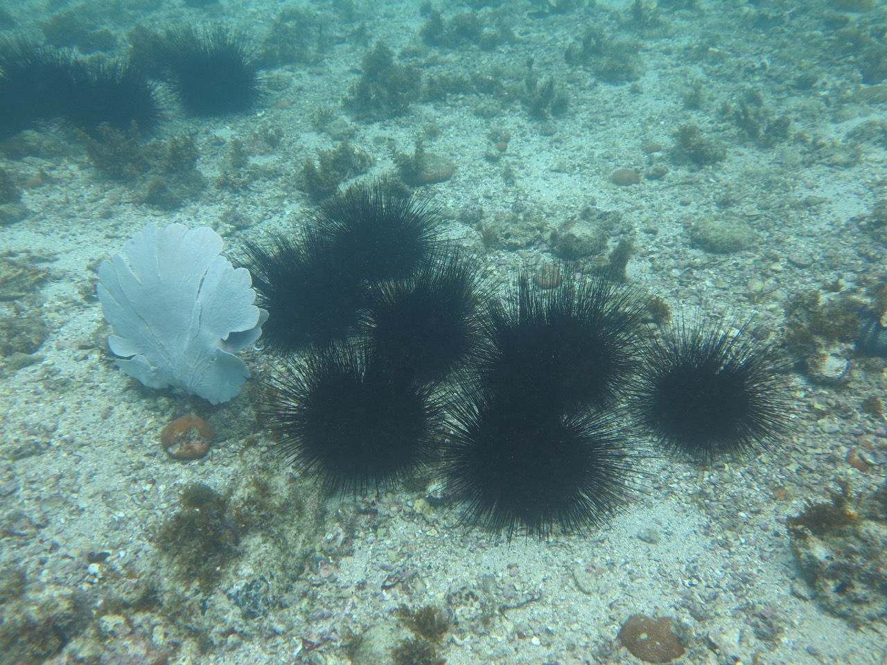
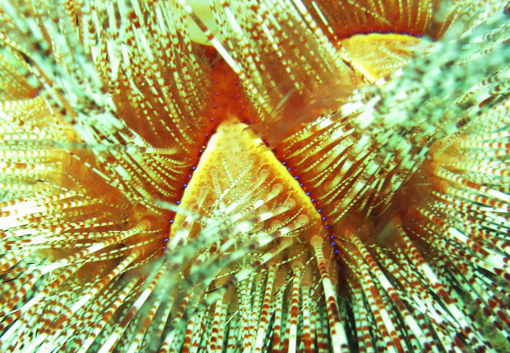

<style>
body {
text-align: justify}
</style>


```{=html}
<style>
body {
text-align: justify}
</style>
```
```{r setup, include=FALSE}
knitr::opts_chunk$set(echo = TRUE, warning = FALSE, message = FALSE)
```

```{r klippy, echo=FALSE, include=TRUE}
#klippy::klippy(position = c('top', 'right'))
```

## **Protocolo de monitoramento de populações do ouriço-de-fogo *Astropyga* sp. com ajuda da ciência cidadã**

A espécie de ouriço-do-mar *Astropyga magnifica*, também conhecida como
ouriço-de-fogo, é encontrada desde o Caribe até a região sul do Brasil
([Hendler et al., 1995]()), logo não se trata de uma espécie exótica.
Esta espécie é considerada rara e com pouca abundância natural nas áreas
de ocorrência, sendo observada entre 5 e 88 metros de profundidade
([Serafy, 1979]()). No entanto, os ouriços-de-fogo têm sido avistados
por cientistas e mergulhadores com maior frequência no litoral sudeste
do Brasil desde 2015. O primeiro registro de uma espécie do gênero
*Astropyga* no Brasil foi feito em 1958 em Ubatuba (SP) ([Tomasi,
1958]()), sendo raramente observado novamente na região. Os
ouriços-do-mar tem um papel importante importante na dinâmica dos
ambientes recifais ([Cordeiro et al., 2020]()) e tem uma tendência
natural a explosões populacionais ([Uthicke et al., 2008]()). Existem
poucas informações sobre essas espécies de ouriços-do-mar no litoral
brasileiro, especialmente do gênero Astropyga. Por esse aumento
populacional recente nas regiões sudeste e sul do Brasil, é necessario
que seja feito um acompanhamento das populações de ouriços-do-mar e seus
possíveis efeitos nas comunidades recifais. Os ouriços-de-fogo são de
fácil visualização e identificação por seu padrão de cor (vermelho
claro-alaranjado a vermelho escuro) e tamanho (7 a 15 cm de diâmetro sem
espinhos), normalmente são bem maiores do que de outras espécies mais
comuns, como o ouriço-preto e o ouriço-verde. Assim, esta é uma espécie
que dificilmente passa despercebida aos olhos dos mergulhadores, o que
facilita o registros das ocorrência. Esta é a situação ideal para
utilizarmos esta espécie-alvo em programas de monitoramento contando com
a ajuda de cientistas cidadãos. Assim, segue abaixo um protocolo de
monitoramento que pode ser aplicado por qualquer mergulhador e irá
contribuir muito para compreendermos melhor a dinâmica das populações de
ouriços-de-fogo. <br><br>

### Caracretísticas do ouriço-de-fogo

-   movimentação rápida em relação a outras espécies de ouriços-do-mar;
-   espinhos longos, aproximadamente do tamanho do corpo (figura 1);
-   normalmente são encontrados na areia ou na parte mais profunda dos
    costões na interface entre areia e rocha, ou nas rochas próximas ao
    fundo (figura 2);

<center>


<br><br>

</center>

**Figura 1.** Foto: Jessica Link (Ilha do Arvoredo, Santa Catarina).

-   apresentam dois padrões de coloração, uma clara com espinhos em
    padrão rajado de branco (figura 1) e outra de cor escura quase preta
    com tom avermelhado (figura 2);

<center>

 <br><br>

</center>

**Figura 2.** Foto: Thiago Mendes (Arraial do Cabo, RJ).

<center>

 <br><br>

</center>

**Figura 3.** Foto: Jessica Link (Ilha do Arvoredo, Santa Catarina).

-   cinco faixas de pontos azuis brilhantes no corpo (figura 3);

<center>

 <br><br>

</center>

**Figura 4.** Foto: Bianca Sahn (Arquipélago de Alcatrazes, SP).

-   pode apresentar ou não uma pequena bolsa na região superior do corpo
    (figura 4).

------------------------------------------------------------------------

## Protocolo de monitoramento

Este protocolo pode ser utilizado tanto para ações direcionadas como
para avistamentos ocasionais. As ações direcionadas são aquelas em que
os mergulhos são dedicados à procura de ouriços-de-fogo e podem ser
aplicadas como uma atividade recreativa desafiadora aos mergulhadores
para aumentar o engajamento e tornar o mergulho mais contemplativo. Os
avistamentos ocasionais são aqueles em que os ouriços-de-fogo foram
encontrados pelos mergulhadores durante os mergulhos mas não eram o
motivo do mergulho. Abaixo, descrevemos como agir e quais
características anotar quando avistar um ouriço-de-fogo:

1.  **Avistamento ocasional**

    1.  Quando encontrar um ou mais ouriços-de-fogo, o que fazer?

        1.  *Não toque ou tente remover os ouriços-de-fogo para evitar
            danos aos animais e acidentes com mergulhadores*,

        2.  **Anote**:

            1.  profundidade da observação,

            2.  temperatura (se possível),

            3.  número de ouriços avistados,

            4.  tamanho estimado sem contar o tamanho dos espinhos
                (tente usar algum objeto de tamanho conhecido para
                calibrar sua estimativa - lembre que as coisas parecem
                maiores embaixo da água),

            5.  se os ouriços formarem grupos, tente anotar os dados de
                quantidade, tamanho e profundidade para cada grupo,

            6.  fotografar ou filmar (se possível) mostrando parte do
                ambiente onde o(s) ouriço(s) estava(m),

            7.  tempo total de mergulho (ao finalizar o mergulho),

            8.  nome do ponto de mergulho com o máximo de detalhes, por
                exemplo: 'lado oeste da baía do Farol, Ilha do
                Arvoredo´.

<!-- -->
<br></br>

1.  **Ação direcionada usando método de busca ativa**

    1.  Os mergulhadores devem formar duplas e nadarem em paralelo, mais
        ou menos, a 3 m distância ou o máximo que a visibilidade
        permitir, porém não se afastar mais que 10m do costão por
        segurança;

    2.  A dupla deve nadar sobre a área do costão fazendo uma varredura
        contínua sempre no sentido único. Recomenda-se iniciar na parte
        mais funda do loca, junto à interface da areia com o costão. Ao
        se completar um terço da reserva se ar ou do tempo
        pré-determinado de mergulho, os mergulhadores retornam no
        sentido oposto cobrindo a área acima da área já amostrada;

    3.  Recomenda-se prestar atenção a áreas de buracos, fendas e com
        areia;

    4.  Quando encontrar um ou mais ouriços-de-fogo, anotar as mesmas
        informações da sessão anterior de avistamento ocasional, ou
        seja, profundidade, número de indivíduos, temperatura,
        fotografar etc

<br></br>

Os dados das observações podem ser enviados para
[cesarcordeiro\@uenf.br](mailto:cesarcordeiro@uenf.br){.email}. Não
esqueça de indicar o nome de quem realizou a observação e deixar um
contato para que possamos entrar em contato e dar o crédito aos
colaboradores do projeto. Os dados das avistagens vão ser incluídos na
plataforma iNaturalist (<https://www.inaturalist.org/>) e no site do
projeto (<https://cammcordeiro.github.io/ourico-de-fogo>), com os nomes
e fotos dos colaboradores. O site do projeto irá manter atualizadas as
informações de dinâmica das populações e novas ocorrências, mantendo
sempre os colaboradores informados dos resultados mais recentes.
